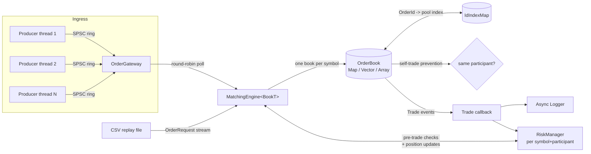

# LightningLOB

A low-latency limit order book and matching engine, written from scratch in modern C++20.

LightningLOB implements price-time-priority matching for Limit, Market, IOC, and FOK orders
with self-trade prevention; three independently-benchmarked price-level data structures
(`std::map`, a sorted `std::vector`, and a hand-rolled direct-indexed array with
bitmap-accelerated best-price tracking); a purpose-built open-addressing hash map that
replaces `std::unordered_map` on the order-lookup hot path; a lock-free multi-producer
order-ingress pipeline; per-participant pre-trade risk checks; and deterministic CSV replay - all backed by 207 GoogleTest cases and a Google Benchmark suite whose numbers are reproduced verbatim in this document, not hand-waved.

This project exists to demonstrate the kind of systems-programming judgment that low-latency
trading infrastructure demands: cache-conscious data layout, deliberate allocation
discipline, memory-model-correct concurrency (verified under ThreadSanitizer), and being honest about a design's trade-offs, a
benchmark's limitations, and the real bugs its own test suite caught along the way, rather
than only reporting the favorable numbers.

## Table of contents

- [Architecture](#architecture)
- [The three price-level data structures](#the-three-price-level-data-structures)
- [The order-id hash map](#the-order-id-hash-map)
- [Matching semantics](#matching-semantics)
- [Self-trade prevention and per-participant risk](#self-trade-prevention-and-per-participant-risk)
- [Building](#building)
- [Running](#running)
- [Testing](#testing)
- [Benchmarking](#benchmarking)
- [Performance results](#performance-results)
- [Concurrency correctness](#concurrency-correctness)
- [Design decisions and trade-offs](#design-decisions-and-trade-offs)
- [Project structure](#project-structure)
- [Future improvements](#future-improvements)
- [License](#license)

## Architecture



A single matching thread owns each symbol's book - there is no locking inside the matching
path itself. Concurrency is confined to the boundary: producer threads (order-entry sessions,
or the replay/benchmark harness) each get their own lock-free single-producer/single-consumer
ring buffer ("lane"), and the matching thread round-robins across all lanes. See
[Design decisions](#design-decisions-and-trade-offs) for why this "sharded SPSC" shape was
chosen over a general lock-free MPSC queue.

`MatchingEngine<BookT>` is a template, not a class built around a virtual `OrderBook`
interface - the concrete book type is resolved at compile time, so there is no vtable
indirection on the hot path, and swapping data-structure approaches is a template parameter.

## The three price-level data structures

This is the centerpiece of the project. All three implementations share the exact same
order-pool, intrusive-FIFO-list, and order-id-lookup code (`order_pool.hpp`, `id_index_map.hpp`)
and pass an identical ~40-case behavioral test suite (`tests/order_book_test.cpp`, run via
GoogleTest typed tests) - so the only thing that differs between them, by construction, is
*how a price level is found*.

| | `OrderBookMap` | `OrderBookVector` | `OrderBookArray` |
|---|---|---|---|
| Storage | `std::map<Price, PriceLevel>` per side | sorted `std::vector<PriceLevel>` per side | direct-indexed `std::vector<PriceLevel>` sized to `[min_price, max_price]`, plus an occupancy `Bitset` |
| Find/create a level | O(log L) | O(log L) find, O(L) insert/erase (shifts) | **O(1)**, always |
| Best bid/ask | O(1) (`begin()`) | O(1) (`front()`) | O(1) amortized (cached index; bitmap scan only when the *current best* level empties) |
| Cache behaviour | Poor - each level is a separate heap node, pointer-chased | Excellent for reads - contiguous, but shifting on insert/erase | Excellent, and O(1) doesn't depend on it |
| Price range | Unbounded, sparse-friendly | Unbounded, sparse-friendly | **Bounded** - must configure `[min_price, max_price]` up front |
| Memory | O(distinct levels) | O(distinct levels) | O(price range), regardless of occupancy |

**`OrderBookArray`'s trick**, since it's the least conventional of the three: real venues quote
within a known band (tick tables, limit-up/limit-down collars), so instead of *searching* for
a price level, its location can be *computed*: `index = price - min_price`. Both sides get a
`std::vector<PriceLevel>` sized to the whole configured range, plus a `Bitset` flagging which
indices are occupied. Add/cancel at any price - new level or existing - is O(1): compute the
index, touch that slot, set/clear one bit. The only operation that isn't trivially O(1) is
*moving the best-price pointer after the current best level empties*, which needs to find the
next occupied index. That's done word-at-a-time with `std::countr_zero`/`std::countl_zero`
(`bitset_utils.hpp`) - a handful of CPU instructions to skip 64 price levels at once, rather
than testing one price at a time. This is only paid when the best level itself empties, not on
every cancel, and it's the one piece of bit-manipulation in this project that got its own
isolated unit tests (`tests/bitset_utils_test.cpp`) before it was ever wired into matching
logic, specifically because it's the easiest place to introduce a subtle off-by-one.

The price paid for all of this: the range must be known and bounded up front (an order priced
outside it is rejected - `RejectReason::PriceOutOfRange`), and two full-range arrays are
allocated whether or not most of the range ever sees an order. `OrderBookArray::reset()`
mitigates the second cost when a book is reused (e.g. across benchmark iterations or a session
restart): rather than touching the full range, it walks only the bits the occupancy bitmap
says are actually set.

## The order-id hash map

Every book still needs one more lookup beyond price-level indexing: given an `OrderId` (for a
cancel or amend), find which pool slot holds it. All three approaches originally used
`std::unordered_map<OrderId, uint32_t>` for this, and the very first benchmarks in this
project showed a ~230-320 ns latency floor common to *all three* - visible even on
`OrderBookArray`, whose price-level lookup is O(1) by construction. That floor was
`std::unordered_map` itself: a node-based container that heap-allocates one node per entry
and chases a pointer to reach it.

`IdIndexMap` (`id_index_map.hpp`) replaces it with open addressing into one contiguous
`std::vector` - no per-entry allocation, no pointer chasing - Fibonacci hashing for good key
distribution regardless of whether `OrderId`s happen to be sequential or adversarial, and
**Knuth's backward-shift deletion** (TAOCP Vol. 3, Algorithm R2) instead of tombstones:
erasing an entry repairs the probe sequence in place, so lookups never have to skip over dead
slots and the table never accumulates cruft no matter how many cancels it sees over its
lifetime.

Backward-shift deletion is exactly the kind of algorithm that looks right after a careful
derivation and still hides an off-by-one, so it wasn't trusted on the derivation alone: a
differential fuzz test runs hundreds of thousands of random insert/erase/find operations
against a deliberately small key space (forcing heavy slot churn) with **exact agreement
against `std::unordered_map` checked after every single operation**, and the same fuzz test
was additionally run clean under AddressSanitizer and UndefinedBehaviorSanitizer. Measured in
isolation (see [Performance results](#performance-results)), it's 3-5x faster than
`std::unordered_map` for the insert/find/erase cycle.

## Matching semantics

- **Price-time priority.** Within a price level, orders are matched strictly FIFO (oldest
  first); trades always execute at the *resting* (maker) order's price, never the taker's.
- **Limit orders** rest in the book (GTC) if not fully filled on entry, unless marked IOC or FOK.
- **Market orders** always attempt to match immediately and are *never* rested - any unfilled
  remainder is discarded, matching standard exchange behaviour for marketable order types.
- **IOC** (Immediate-Or-Cancel) limit orders behave like a price-bounded market order: fill
  what's immediately available, discard the rest.
- **FOK** (Fill-Or-Kill) orders fill completely or not at all, with zero partial fills either
  way: `add_order()` runs a liquidity dry-run (`has_liquidity_for()`, summing resting
  opposite-side quantity subject to the same price bound the matching loop itself uses,
  with an early exit once enough is found) *before* attempting any match. If there isn't
  enough, the order never touches the book - no trades, nothing rests. If there is, the match
  is guaranteed to fully consume it, because the dry-run and the real matching loop use
  exactly the same crossing condition. Works for both Limit FOK (price-bounded) and Market
  FOK (sweeps whatever exists, price-unbounded, but still all-or-nothing).
- **Amend** follows common venue cancel-replace rules: a pure size *decrease* at the same
  price keeps the order's queue position; a size *increase* or a price change loses it
  (implemented as cancel-then-resubmit, which also means an amend that makes the order
  marketable executes immediately - this falls out of reusing `add_order` rather than being
  special-cased).

## Self-trade prevention and per-participant risk

`Order`/`OrderRequest` carry a `ParticipantId` (0 = unattributed, and never triggers
self-trade prevention against anything - including another unattributed order). Each book is
configured at construction with a `SelfTradePrevention` policy (default `None`, fully
backward compatible with code that never sets participant ids):

- **`CancelResting`** - the resting order that would self-trade is cancelled; the taker keeps
  trying to match against whatever's next.
- **`CancelIncoming`** - matching stops immediately; the taker's remaining quantity is killed,
  the resting order is untouched.
- **`CancelBoth`** - both are cancelled, matching stops.

This is checked *before* any quantity changes hands, so a triggered policy never produces a
trade - verified directly by a 200,000-order randomized stress test across all three policies
asserting the one invariant that actually matters: not one trade, out of however many did
happen, ever matched two orders from the same participant.

`RiskManager` tracks pre-trade size/position/rate-limit checks and post-trade position
**per `(symbol, participant)` pair**, not pooled per symbol - two different participants
trading the same instrument have entirely separate exposure and entirely separate limits.
Position tracking itself is unconditional (it doesn't require `set_limits()` to have been
called first; `set_limits()` is only for opting a participant *into*
enforced limits, which default to unrestricted otherwise.

## Building

Requires a C++20 compiler (developed against GCC 13) and CMake >= 3.22. Dependencies
(GoogleTest, Google Benchmark) are fetched automatically via `FetchContent` - nothing to
install by hand beyond the compiler and CMake itself.

```bash
git clone <this-repo>
cd LightningLOB
cmake -B build -DCMAKE_BUILD_TYPE=Release
cmake --build build -j$(nproc)
```

Useful CMake options (pass as `-D<option>=ON/OFF` or `-D<option>=<value>`):

| Option | Default | Effect |
|---|---|---|
| `LIGHTNINGLOB_BUILD_TESTS` | `ON` | Build the GoogleTest suite |
| `LIGHTNINGLOB_BUILD_BENCHMARKS` | `ON` | Build the Google Benchmark suite |
| `LIGHTNINGLOB_NATIVE_ARCH` | `OFF` | Add `-march=native` (faster, less portable) |
| `LIGHTNINGLOB_SANITIZER` | *(empty)* | `address`, `thread`, or `undefined` |

Release builds enable link-time optimization automatically when the toolchain supports it -
see [Design decisions](#design-decisions-and-trade-offs) for why that matters here.

CI (`.github/workflows/ci.yml`) builds Debug and Release on every push, enforces a zero-warnings
policy under a strict flag set, runs the full suite under all three sanitizers, and smoke-runs
the benchmark suite (deliberately not as a performance gate - see the workflow file for why).

## Running

```bash
./build/lightninglob_cli              # scripted walkthrough: add/match/cancel/amend, with logging
./build/lightninglob_cli replay data/sample_orders.csv   # replay a historical order file
./build/lightninglob_cli mt-demo      # multi-producer / lock-free-gateway throughput demo
```

The scripted walkthrough logs every order/trade/cancel through the async `Logger` and prints
book snapshots before and after, so the whole story of what matched against what is visible
and independently checkable - this is also how the matching logic was manually validated
while it was being built. `mt-demo` additionally attempts to pin its matching thread to a
dedicated core with real-time scheduling - but only when more than one core is actually
available; see [Design decisions](#design-decisions-and-trade-offs) for why doing this
unconditionally is actively dangerous, not just ineffective, on a single-core machine.

## Testing

```bash
cmake --build build -j$(nproc)
ctest --test-dir build --output-on-failure
```

207 tests across 16 suites, including:
- A **typed test suite** (`order_book_test.cpp`) run identically against all three book
  implementations - price-time priority, partial fills, IOC/Market/FOK semantics, amend
  priority rules, cancel, self-trade prevention under all three policies, depth snapshots,
  `reset()`, and more, so behavioral parity across all three approaches is a compiled-and-checked
  fact, not a claim.
- `OrderBookArray`-specific tests for the bounded price range and best-price bitmap scans
  across wide, multi-word-spanning gaps.
- A **differential fuzz test** for `IdIndexMap` (hundreds of thousands of random operations
  cross-checked against `std::unordered_map` after every single one) plus a growth test and
  targeted backward-shift-deletion cases.
- A two-thread stress test for the lock-free SPSC queue (5,000,000 records, checked for
  strict FIFO order and per-record integrity), which also passes cleanly under
  ThreadSanitizer - see [Concurrency correctness](#concurrency-correctness).
- A 200,000-order randomized stress test asserting zero self-trades ever occur, across all
  three self-trade-prevention policies.
- A multi-producer `OrderGateway` end-to-end test and full `MatchingEngine` integration tests
  (risk rejection never touching the book, per-participant position tracking, symbol routing,
  self-trade-prevention policy propagation from `add_symbol()` down to the book).
- CSV replay tests against both a small hand-crafted fixture with hand-verified expected
  fills, and the full checked-in sample dataset.

Run with a sanitizer:

```bash
cmake -B build-tsan -DCMAKE_BUILD_TYPE=RelWithDebInfo -DLIGHTNINGLOB_SANITIZER=thread -DLIGHTNINGLOB_BUILD_BENCHMARKS=OFF
cmake --build build-tsan --target lightninglob_tests -j$(nproc)
./build-tsan/tests/lightninglob_tests --gtest_filter="*SpscRingBuffer*:*OrderGateway*"
```

This exact command (verified while building this project, and run on every push via CI) runs
the 5,000,000-record two-thread stress test - and the multi-producer gateway tests - through
GoogleTest, instrumented with ThreadSanitizer. Zero races reported.

## Benchmarking

```bash
cmake --build build --target lightninglob_benchmarks -j$(nproc)
./build/benchmarks/lightninglob_benchmarks
# or, a subset:
./build/benchmarks/lightninglob_benchmarks --benchmark_filter="CancelOrder"
```

`scripts/run_benchmarks.sh` builds and runs the full suite with sensible defaults.
`scripts/generate_sample_data.py` regenerates or resizes `data/sample_orders.csv`
(deterministic given a fixed seed).

## Performance results

**Methodology and an important caveat, read this first:** these numbers were measured on a
**single-vCPU sandboxed cloud VM** (Intel Xeon, ~2.1 GHz, 1 core, shared with other tenants),
not dedicated, isolated benchmarking hardware. That means: no CPU pinning to a spare core (see
[Self-trade prevention and per-participant risk](#self-trade-prevention-and-per-participant-risk)
- there is no spare core on this box to pin *to*), no disabled turbo boost/frequency scaling,
no `perf stat`-verified isolation, and visible run-to-run variance from neighbor noise.

**The absolute nanosecond figures below should be read as "this environment, this sitting,"
not as a hardware-independent constant.** What *is* robust - because it reflects each
approach's actual algorithmic complexity, not machine noise - is the **relative shape**: how
each data structure scales with book depth, and the order-of-magnitude improvement from
`IdIndexMap`. That comparison is the point of this section.

### Add / Cancel / Match latency vs. book depth

All figures are nanoseconds per operation (Google Benchmark, `-O3` + LTO, single iteration
cost after warmup). "Depth" is the number of distinct resting price levels on one side of the
book at the moment of the operation; see `benchmarks/order_book_bench.cpp` for exactly what
each benchmark isolates (new-level insertion vs. appending to an existing level's queue, etc.).

**Add a brand-new price level:**

| Depth | `std::map` | sorted `vector` | array |
|---:|---:|---:|---:|
| 16 | 299 ns | 311 ns | 311 ns |
| 512 | 303 ns | 350 ns | 278 ns |
| 4,096 | 311 ns | 1,093 ns | 261 ns |
| 32,768 | 331 ns | 8,959 ns | 286 ns |
| 65,536 | 357 ns | 17,787 ns | 329 ns |

**Cancel an order:**

| Depth | `std::map` | sorted `vector` | array |
|---:|---:|---:|---:|
| 16 | 246 ns | 201 ns | 201 ns |
| 512 | 286 ns | 308 ns | 217 ns |
| 4,096 | 334 ns | 1,056 ns | 241 ns |
| 65,536 | 395 ns | 17,802 ns | 270 ns |

**Marketable order that crosses and fully consumes the best level:**

| Depth | `std::map` | sorted `vector` | array |
|---:|---:|---:|---:|
| 16 | 274 ns | 311 ns | 331 ns |
| 4,096 | 289 ns | 320 ns | 308 ns |
| 32,768 | 296 ns | 7,990 ns | 442 ns |
| 65,536 | 326 ns | 23,781 ns | 493 ns |

The story is exactly what the complexity analysis predicts: **`std::map` grows slowly and
predictably** (O(log L) - a 4,000x increase in depth costs it well under 50% more time per
op). **The sorted vector is competitive at shallow depth** - it's the most cache-friendly of
the three for a small, contiguous set of levels - **but degrades sharply as depth grows**, up
to roughly **50-75x slower** at 65,536 levels, from shifting array elements on every
insert/erase that isn't at the very front. **The array stays essentially flat** for add/cancel
across the entire depth range, confirming its O(1) design goal empirically, not just on paper.

The one honest asterisk on the array's story: **match latency does creep up at extreme
depth** (roughly 300 ns to 490 ns from depth 16 to 65,536, versus staying flat for
add/cancel). At depth 65,536 the two full-range `PriceLevel` arrays approach this machine's
L2 cache capacity (~2 MB), so this is very likely a cache-capacity effect rather than an
algorithmic one, and even at its worst it's still **~48x faster than the vector** at the same
depth. It's a real, worth-knowing cost of sizing a price range much larger than what's
actually traded, not a flaw in the O(1) claim for the operations that don't touch a wide span
of memory.

### The order-id hash map, isolated

Measured in a standalone benchmark built directly against `IdIndexMap` and
`std::unordered_map<OrderId, uint32_t>` side by side - same process, same run, so this
comparison isn't exposed to the cross-session hardware-drift risk described above:

| Operation pattern | `std::unordered_map` | `IdIndexMap` | Speedup |
|---|---:|---:|---:|
| Insert+find+erase cycle, depth 16 | 402 ns | 122 ns | 3.3x |
| Insert+find+erase cycle, depth 4,096 | 127,222 ns | 27,112 ns | 4.7x |
| Insert+find+erase cycle, depth 65,536 | 2,619,343 ns | 574,303 ns | 4.6x |
| Pure `find()`, any depth | ~8.4 ns | ~5.8 ns | ~1.4x |

### Realistic mixed-workload throughput (replaying `data/sample_orders.csv`, 5,000 orders)

| | Book only | Full `MatchingEngine` (risk checks + id/timestamp assignment) |
|---|---:|---:|
| `std::map` | 7.70M orders/sec | 6.38M orders/sec |
| sorted `vector` | 8.19M orders/sec | 7.17M orders/sec |
| **direct-indexed array** | **8.51M orders/sec** | **7.68M orders/sec** |

This dataset is a realistic mix of resting limit orders, marketable crosses, and IOC/market
orders clustered near a random-walk mid-price (see `scripts/generate_sample_data.py`) -
levels stay shallow (a few hundred at most), which is why the vector isn't catastrophically
behind here the way it is in the depth-stress benchmarks above: at realistic, modest book
depth, all three approaches are within roughly 10% of each other, and the array's O(1)
guarantee is headroom for depth the vector doesn't have, more than a dominant factor at this
specific depth. The gap between "book only" and "full engine" is the measured cost of
`MatchingEngine`'s risk checks and id/timestamp bookkeeping - roughly 10-17% here, a
reasonable, honestly-labeled overhead for pre-trade risk on every single order.

### Lock-free SPSC queue and multi-threaded throughput

| | Result |
|---|---:|
| Single-threaded push+pop (no contention) | ~1.1 ns/op (approx. 920M ops/sec) |
| Real two-thread throughput (separate producer/consumer `std::thread`s) | ~359M items/sec |
| Multi-producer gateway, 4 producers -> 1 matching thread, 1,000,000 orders total, full `MatchingEngine<OrderBookArray>` | **~3.5-4.6M orders/sec end-to-end**, `lightninglob_cli mt-demo` |

The multi-producer number carries the same one-vCPU caveat as everything else here, in a
sharper form: this sandbox has **exactly one core**, so five OS threads (four producers, one
matching thread) are being time-sliced across it - this measures scheduling contention, not
genuine cross-core parallelism. The architecture (per-producer SPSC lanes, round-robin polled
by one matching thread) is built for real multi-core hardware. How much this single-core
constraint actually matters was demonstrated more dramatically than intended partway through
this project: an early version of `mt-demo` unconditionally pinned its matching thread and
gave it `SCHED_FIFO` real-time priority, expecting a modest latency benefit. On this one-core
box, that collapsed throughput from ~4M orders/sec to **~32,000** - a real-time thread that
never blocks never yields the only core that exists, so the four producer threads it depends
on starved completely. `mt-demo` now checks `std::thread::hardware_concurrency()` and skips
both pinning and real-time priority below two cores. On a machine with a spare core to
dedicate, this project expects both the raw multi-producer throughput and the benefit of
pinning/real-time scheduling to be substantially better and far less variable - untested by this sandbox, and stated as an expectation rather than a measurement for exactly
that reason.

## Concurrency correctness

The lock-free `SpscRingBuffer` (`lockfree_queue.hpp`) is the one piece of challenging *concurrent* code in this project:

1. Single-threaded correctness tests (push/pop/full/empty/wraparound).
2. A two-thread stress test pushing 5,000,000 sequence-numbered, checksummed records and
   verifying strict FIFO order and zero corruption on the receiving end.
3. **The same stress test run under ThreadSanitizer** (`-fsanitize=thread`) - zero races
   reported, on every push via CI. This is the difference between "the memory ordering looks
   right" and "it's been checked by a tool built specifically to catch the class of bug that
   looks right and isn't."

```bash
cmake -B build-tsan -DCMAKE_BUILD_TYPE=RelWithDebInfo -DLIGHTNINGLOB_SANITIZER=thread -DLIGHTNINGLOB_BUILD_BENCHMARKS=OFF
cmake --build build-tsan --target lightninglob_tests -j$(nproc)
./build-tsan/tests/lightninglob_tests --gtest_filter="*SpscRingBuffer*:*OrderGateway*"
```

Self-trade prevention's core safety property - not one trade, ever, matches two orders from
the same participant - is checked the same evidence-over-assertion way: not just hand-picked
cases, but a 200,000-order randomized stress test across all three STP policies.

## Design decisions and trade-offs

A few choices worth explaining rather than leaving implicit, the hardware-drift and real-time-scheduling incidents
summarized above, and why `Order` growing from 48 to 56 bytes for participant tracking was a
deliberate, documented trade-off rather than an oversight.

**Header/source split, recovered with LTO.** Each order book's hot-path logic lives in a
`.cpp`, not header-inlined - normal software-engineering reasons (faster incremental
rebuilds, a stable interface boundary) that would cost cross-translation-unit inlining in a
latency-sensitive codebase if left alone. Release builds enable interprocedural (link-time)
optimization specifically to recover that inlining, so the split doesn't cost what it would
in a naive build. `MatchingEngine<BookT>` is the one exception - as a template it's
necessarily header-only.

**`noexcept` as a judgement call, not a guarantee-by-construction, on the cancel path.**
`cancel_order` is marked `noexcept` on all three book implementations. Every container
operation it performs - an `IdIndexMap`/`std::map` lookup/erase keyed on a trivial integer
`OrderId`, list-unlink arithmetic - will not allocate or meaningfully fail in practice, but
the standard library doesn't put a formal `noexcept` guarantee on every one of these
operations in the general case. This is a considered exception-safety judgement, common in
latency-sensitive C++: if it's ever wrong, `std::terminate` is the correct, loud failure mode
for a bug in code that fundamentally must not allocate here - not a claim that the compiler
enforced it. `OrderPool::release()`'s `noexcept` is stronger: it's provably correct, because
`acquire()`'s cold path keeps the free-list's reserved capacity in lock-step with the pool's,
so `release()`'s `push_back` can never trigger a reallocation. `RiskManager::on_fill()`
deliberately does **not** claim `noexcept`, for the same honesty: it can insert a fresh
per-participant entry on first contact, and unlike the lookup-only operations elsewhere,
that's a real, acknowledged allocation path.

**Sharded SPSC instead of a general lock-free MPSC queue.** A single lock-free multi-producer
queue is a meaningfully harder primitive than SPSC - producers need a CAS loop to claim a
slot, reintroducing contention and ABA-shaped hazards. Giving each producer thread its own
`SpscRingBuffer` and having the matching thread round-robin-poll all of them keeps every
individual queue within the simple, TSan-verified SPSC guarantees; the "many producers"
property comes from there being many lanes, not from a cleverer queue. This is also a
legitimate real-world pattern (one ring per session/gateway connection feeding one engine
thread), not a simplification invented for this project.

**Market/IOC/FOK orders never rest.** An unfilled market order, an IOC limit order with
leftover quantity, or an FOK order that couldn't be fully satisfied is discarded rather than
resting in the book - standard behaviour for those order types at real venues.

## Project structure

```
LightningLOB/
├── CMakeLists.txt
├── .github/workflows/ci.yml   # build/test matrix, sanitizers, warnings gate, benchmark smoke
├── include/lightninglob/       # all public headers
│   ├── types.hpp                # core aliases, enums, sentinels
│   ├── order.hpp                 # Order / OrderRequest / Trade / ExecutionReport
│   ├── order_pool.hpp            # shared pool + intrusive FIFO list (all 3 books use this)
│   ├── id_index_map.hpp          # open-addressing OrderId -> pool-index hash map
│   ├── bitset_utils.hpp          # Bitset with O(1)-amortized nearest-set-bit scans
│   ├── order_book_map.hpp        # Approach A
│   ├── order_book_vector.hpp     # Approach B
│   ├── order_book_array.hpp      # Approach C
│   ├── matching_engine.hpp       # MatchingEngine<BookT>, header-only (template)
│   ├── risk_manager.hpp          # per-(symbol, participant) size/position/rate checks
│   ├── lockfree_queue.hpp        # SpscRingBuffer<T, Capacity>
│   ├── order_gateway.hpp         # sharded multi-producer ingress on top of the SPSC queue
│   ├── thread_affinity.hpp       # best-effort core pinning / real-time scheduling
│   ├── logger.hpp                 # async logger built on the SPSC queue
│   └── replay.hpp                 # CSV loading + ReplayStats
├── src/                         # implementations for the non-template headers, + main.cpp
├── tests/                       # 207 GoogleTest cases across 16 suites
├── benchmarks/                  # Google Benchmark suite
├── data/                        # sample_orders.csv + a tiny hand-verified replay fixture
└── scripts/                     # generate_sample_data.py, build.sh, run_benchmarks.sh
```

## Future improvements

Honestly scoped, not swept under the rug:

- **Verification on real multi-core hardware.** Both the multi-producer throughput numbers
  and the `thread_affinity.hpp` pinning/real-time-scheduling helpers are functionally
  complete and tested for correctness (they degrade safely; they succeed when the OS
  permits), but this project's single-vCPU sandbox cannot demonstrate - only reason about -
  the latency/throughput benefit either is meant to provide.
- **Multi-participant risk enforcement across a shared limit hierarchy** (e.g. a firm-wide
  cap in addition to each participant's own) - currently every `(symbol, participant)` pair
  is independent, with no notion of an aggregate limit spanning several participants.
- **A custom hash map for `OrderGateway`'s round-robin bookkeeping** and other remaining
  minor `std::unordered_map`/`std::function` uses outside the three order books' hot path -
  `IdIndexMap` was scoped specifically to the id-lookup bottleneck the original benchmarks
  identified, not applied project-wide.
- **CPU affinity / real-time scheduling made topology-aware beyond a binary "more than one
  core" check** - e.g. explicitly choosing which core to pin to based on which cores the
  producer threads are already using, rather than always core 0.
- **Huge pages** for the `OrderBookArray` level arrays, to reduce TLB pressure at large
  configured price ranges (see the L2-capacity effect noted in the benchmark discussion).
- **Self-trade prevention notifications** - a resting order cancelled by `CancelResting`/
  `CancelBoth` currently disappears from the book silently from the cancelled participant's
  perspective (no event is emitted for it, unlike a trade); a real venue would typically
  notify that participant their order was cancelled and why.

## License

MIT - see [LICENSE](LICENSE).
